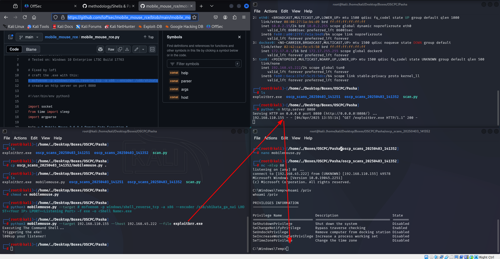

# AD

i start with credentials Eric.Wallows and password EricLikesRunning800 and i have a winrm session with admin privileges so i pivot ->

<figure><figcaption></figcaption></figure>

Then i strings on the tool and grep for passwords and find this:

<figure><figcaption></figcaption></figure>

then i'm able to connect trhough winrm with the credentials and find everything needed to dump:

<figure><figcaption></figcaption></figure>

First i'll set up my pivot on 10.10.188.0/24

<figure><figcaption></figcaption></figure>

Once it is done i reg save sam, security and system hive locally and hit them with the&#x20;

```
secretsdump.py -sam '/path/to/sam.save' -security '/path/to/security.save' -system '/path/to/system.save' LOCAL
```

<figure><figcaption></figcaption></figure>
